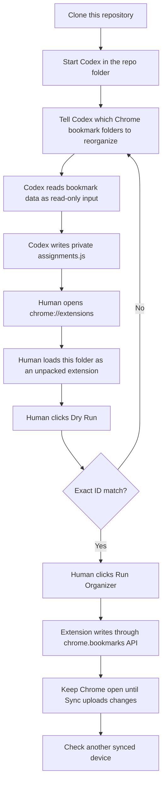

# Chrome Bookmark API Organizer

A minimal Chrome MV3 extension for reorganizing selected bookmark folders through the official `chrome.bookmarks` API.

## Why This Exists

Replacing Chrome's local `Bookmarks` JSON file can be reverted by Chrome Sync. Writing through `chrome.bookmarks.create`, `chrome.bookmarks.move`, and `chrome.bookmarks.removeTree` is different: Chrome treats those calls as normal bookmark mutations and Sync uploads them to other devices.

## Requirements

- Google Chrome or Chromium with extension support.
- A local `assignments.js` file generated for the current Chrome profile.

Nothing else is required.

## What The Extension Reads

The extension reads:

1. the live bookmark tree from the current Chrome profile via `chrome.bookmarks.getTree()`;
2. the local `assignments.js` file in this extension directory.

`runner.html` loads `assignments.js` with:

```html
<script src="assignments.js"></script>
```

Then `runner.js` reads:

```js
globalThis.CODEX_BOOKMARK_ASSIGNMENTS
```

## Intended Workflow



## Generate a Template Without Scripts

The extension can generate an unclassified `assignments.js` template from the live Chrome bookmark tree:

1. Open `chrome://extensions`.
2. Enable `Developer mode`.
3. Click `Load unpacked`.
4. Select this repository folder.
5. Enter target folder names, one per line.
6. Click `Generate Template`.
7. Copy or download the generated template.
8. Let Codex or a human replace `99 Unclassified / Needs Review` with real categories.

This works on macOS, Linux, and Windows because it uses Chrome's own bookmark API, not OS-specific filesystem paths.

## Run The Organizer

1. Back up or export bookmarks in Chrome.
2. Make sure `assignments.js` exists in this repository folder.
3. Load or reload this folder as an unpacked extension.
4. Click `Dry Run`.
5. Click `Run Organizer` only if Dry Run reports an exact match.
6. Keep Chrome open for a few minutes so Chrome Sync can upload the changes.
7. Confirm the result on another synced device.

If you edit `assignments.js`, reload the unpacked extension before running again.

## Temporary Backup Links

The extension page has an optional temporary backup link area. Paste local references into the page, render them, and clear them when finished.

These references are not saved by the extension and should not be committed to the repository.

## assignments.js Format

```js
globalThis.CODEX_BOOKMARK_TARGET_NAMES = [
  "Folder A"
];

globalThis.CODEX_BOOKMARK_ASSIGNMENTS = {
  "Folder A": {
    categoryOrder: ["01 Group A"],
    subcategoryOrder: {
      "01 Group A": ["Bucket A"]
    },
    byId: {
      "123": ["01 Group A", "Bucket A", 0]
    }
  }
};
```

The `byId` key is a Chrome bookmark ID. Its value is:

```text
[categoryFolderName, subcategoryFolderName, orderWithinSubcategory]
```

Rules:

- `CODEX_BOOKMARK_TARGET_NAMES` lists the target folders to reorganize.
- Each key in `CODEX_BOOKMARK_ASSIGNMENTS` must match one target folder name.
- `byId` must include URL bookmark IDs only, not folder IDs.
- Every URL bookmark under each target folder should appear exactly once in `byId`.
- `orderWithinSubcategory` controls ordering inside one subcategory. Lower numbers appear first.

## Files

- `manifest.json`: Chrome MV3 extension manifest.
- `background.js`: Opens the runner page after install or toolbar click.
- `runner.html`: Extension UI.
- `runner.js`: Template generation, Dry Run, and organizer logic.
- `assignments.example.js`: Public synthetic example.
- `assignments.js`: Real private assignment file, ignored by git.
- `docs/operation-workflow.md`: End-to-end human and Codex workflow.
- `docs/data-model.md`: Chrome bookmark formats and extension input contract.
- `docs/generating-assignments.md`: How to create `assignments.js`.
- `docs/agent-instructions.md`: Instructions for coding agents.

## Privacy

Do not commit real `assignments.js`, bookmark exports, bookmark backups, cookies, profile data, or other private data.

## Scope

This project is intended for one-time or occasional bulk bookmark reorganization. For small edits, Chrome's built-in Bookmark Manager is simpler.
