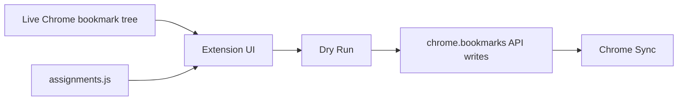

# Architecture

## Project Type

This project is a Chrome MV3 extension.

## System Boundary

This project is responsible for:

- reading the live Chrome bookmark tree through `chrome.bookmarks.getTree()`;
- reading local `assignments.js`;
- generating an unclassified assignment template in the extension UI;
- moving bookmarks with `chrome.bookmarks.move`;
- creating and removing folders with Chrome's bookmark API.

This project is not responsible for:

- replacing Chrome Sync;
- directly rewriting Chrome's local `Bookmarks` file as the final write strategy;
- storing private bookmark data in git.

## Entry Points

| Entry | Purpose |
| --- | --- |
| `manifest.json` | Chrome MV3 extension manifest. |
| `background.js` | Opens `runner.html` after install or toolbar click. |
| `runner.html` | Extension UI. |
| `runner.js` | Template generation, Dry Run, and organizer logic. |
| `assignments.example.js` | Synthetic public example. |
| `assignments.js` | Private local input, ignored by git. |

## Data Flow

## Module Boundaries

| Module | Responsibility | Should Not Do |
| --- | --- | --- |
| `runner.js` | Use Chrome bookmark APIs and apply the assignment contract. | Read OS-specific files. |
| `runner.html` | Provide the UI for template generation, Dry Run, and Run Organizer. | Store private bookmark data in the repository. |
| `docs/` | Explain human and agent workflows. | Reference removed local tooling. |

## Non-goals

- No packaged Chrome Web Store release.
- No cloud service.
- No direct mutation of Chrome's local `Bookmarks` file.
- No automated build pipeline.
