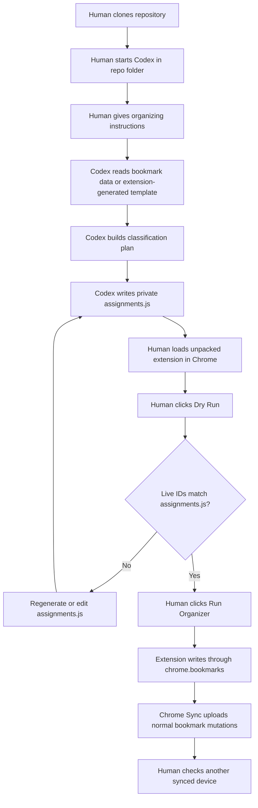
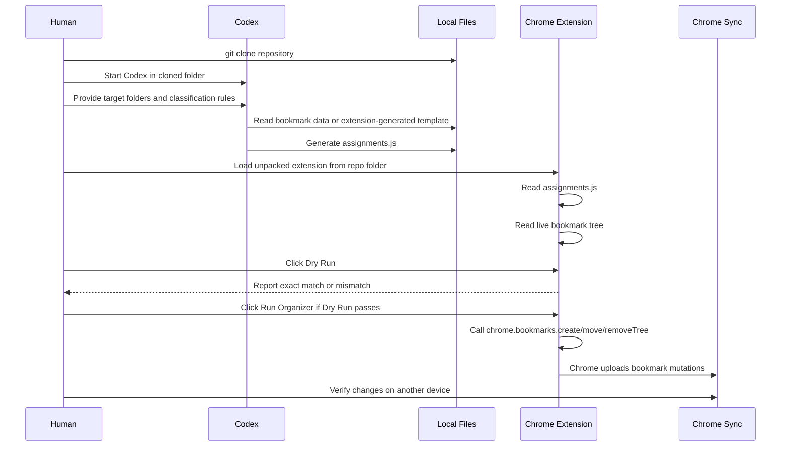

# Operation Workflow

This repository is meant to be used as a local Chrome extension with a coding agent.

The public repository contains the extension shell and documentation. The private `assignments.js` file is generated locally from the user's current Chrome profile and should not be committed.

The workflow requires Chrome only.

## Overview



## Sequence Diagram



## Human Steps

Clone the repository:

```bash
git clone https://github.com/virtuecho/chrome-bookmark-api-organizer.git
cd chrome-bookmark-api-organizer
```

Start Codex from this folder, then ask it to generate `assignments.js`. Example instruction:

```text
Use this repository to organize my Chrome bookmarks.

Target folders:
- Folder A
- Folder B

Classification priority:
- Bookmark title first
- Existing folder path second
- URL/domain third

Generate assignments.js only.
Do not modify Chrome's Bookmarks file.
Validate that every URL bookmark under each target folder appears exactly once.
```

If Codex cannot read the local `Bookmarks` file directly, load the extension and use `Generate Template`, then give the generated template to Codex.

After Codex finishes:

1. Back up or export Chrome bookmarks.
2. Open `chrome://extensions`.
3. Enable `Developer mode`.
4. Click `Load unpacked`.
5. Select the cloned repository folder.
6. Click `Dry Run` on the extension page.
7. Click `Run Organizer` only if Dry Run reports an exact match.
8. Keep Chrome open for a few minutes so Chrome Sync can upload the changes.
9. Check another synced device before deleting backups.

The extension page also has an optional temporary backup link area. It is for local convenience only; do not commit user-specific backup paths.

## Codex Steps

Codex should:

1. Confirm target folder names.
2. Read the Chrome `Bookmarks` JSON as read-only input, or use an extension-generated template.
3. Identify every URL bookmark under each target folder.
4. Generate a complete `assignments.js` file.
5. Classify bookmarks according to the user instruction.
6. Preserve all bookmark IDs.
7. Put uncertain items in `99 Unclassified/Needs Review`.
8. Remind the user that `assignments.js` is private and ignored by git.

Codex must not use direct file replacement as the final write strategy. The final write should happen when the human runs the extension in Chrome.

## Responsibility Split

| Actor | Responsibilities |
| --- | --- |
| Human | Choose target folders, approve the classification intent, load the unpacked extension, click Dry Run and Run Organizer, confirm Chrome Sync on other devices. |
| Codex | Read bookmark data, classify bookmarks, generate `assignments.js`, validate completeness by inspection, explain mismatches. |
| Extension | Compare live Chrome bookmark IDs to `assignments.js`, perform Chrome API writes, show a report. |
| Chrome Sync | Upload and distribute the resulting bookmark mutations. |

## Regeneration Loop

If Dry Run reports missing or extra IDs:

1. Stop. Do not run the organizer.
2. Make sure the right Chrome profile is being used.
3. Let Chrome finish syncing.
4. Regenerate or edit `assignments.js`.
5. Reload the unpacked extension.
6. Run Dry Run again.
